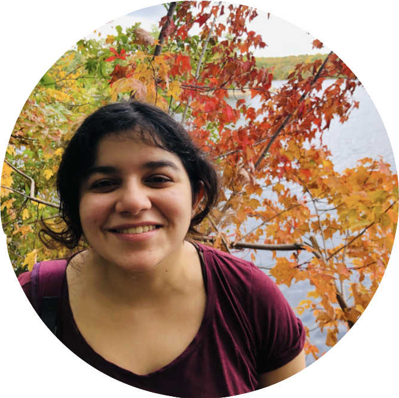

  

Hello, I'm Niharika! I'm a senior at Brown University, from Singapore, studying Computer Science and Linguistics. I like trying to understand languages and people, and am interested in getting computers to do the same!

I'm interested in Multilingualism and Discourse NLP, and the human-centered aspects of Computational Linguistics. I am currently working at the [Brown Language Understanding and Representation (LUNAR) Lab](https://lunar.cs.brown.edu/) researching computational models for implicatures. I am also working on an independent study project exploring the assignment of grammatical gender in code-switching. 
I previously worked at the [Brown Human-Computer Interaction Lab](https://hci.brown.edu/), where I researched sleep tracking and self-experiments, and helped develop the [SleepCoacher iOS application](https://apps.apple.com/us/app/sleepcoacher/id1446980859). 

Aside from words and machines, I enjoy baking, salsa (the dance and the food), learning to play the trumpet, and learning new languages.

To learn more, feel free to go through my [projects](https://niharikajhingan.github.io/ling/), or take a look at my [CV](/assets/downloads/website_cv.pdf).
